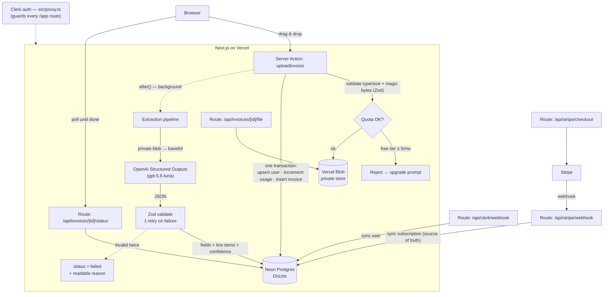

<div align="center">

# InvoiceIQ

**Drop in a PDF or photo of an invoice — get back clean, structured, queryable data in seconds.**

AI-powered invoice parsing SaaS. Upload a document, an LLM extracts the vendor, totals, tax, dates,
line items and a per-field confidence score, and everything lands in a searchable dashboard with
spend analytics and CSV export.

[**Live demo →**](https://invoiceiq-blush.vercel.app)  ·  one click, no signup — hit **“Use demo account.”**

</div>

---

## The problem

Manually keying invoices into a spreadsheet is slow, error-prone, and nobody's idea of a good time.
Bookkeepers and small teams do it hundreds of times a month. InvoiceIQ turns that into a drag-and-drop:
the model reads the document, returns structured fields validated against a strict schema, and flags
anything it's *not* sure about so a human can double-check instead of blindly trusting the output.

The interesting engineering isn't "call an LLM" — it's making the extraction **trustworthy** (Zod-validated
Structured Outputs, per-field confidence, one retry with error feedback, graceful `failed` state), the
data **isolated** (every query scoped to the authenticated user), the quota **race-safe** (enforced inside
the same DB transaction that writes the invoice), and the billing **honest** (Stripe as the source of truth,
synced via idempotent webhooks).

## Demo


▶️ **[Try the live demo](https://invoiceiq-blush.vercel.app)** — hit **“View live demo”** on the landing page
to drop straight into an account preloaded with sample invoices and analytics. No signup required.
(There's also a **“Use demo account”** button on the sign-in page for anyone who lands there directly.)


## Architecture

Next.js App Router on Vercel. Mutations are Server Actions; anything that *must* be an HTTP endpoint
(webhooks, status polling, file streaming, export) is a route handler. Postgres (Neon) via Drizzle,
Clerk for auth, Stripe for billing, OpenAI Structured Outputs for extraction, Vercel Blob (private) for files.



**Extraction pipeline (the core flow):**

1. Client uploads (drag-drop; ≤ 10 MB; pdf/png/jpg — validated client- and server-side, incl. magic-byte sniffing).
2. Quota checked; free tier is **5 documents / calendar month**, rejected with an upgrade prompt if spent.
3. File → private Vercel Blob; then **one transaction** upserts the user, increments the monthly usage
   counter, enforces the quota (row lock = concurrent-upload safe), and inserts the invoice as `processing`.
4. `after()` kicks off extraction in the background: the private blob is fetched and sent to OpenAI with a
   strict JSON schema via **Structured Outputs**.
5. Response is **Zod-validated**; on failure it retries once with the error fed back, else the invoice is
   marked `failed` with a user-readable reason.
6. Fields + line items are saved, `status = completed`. The client polls `/api/invoices/[id]/status`.
7. Every field the model marks **low-confidence** renders with a warning icon — you see what to double-check
   rather than trusting the AI blindly.

### Data model

`users` (synced from Clerk) · `subscriptions` (1:1, Stripe-backed) · `invoices` · `line_items`
· `usage_counters` (composite PK `(user_id, period)` so a quota check is a single indexed read).
Full schema in [`src/server/db/schema.ts`](src/server/db/schema.ts).

## Tech stack & why

| Area | Choice | Why |
| --- | --- | --- |
| Framework | **Next.js 16** (App Router, RSC) | Server Components keep data-fetching on the server and secrets out of the client; Server Actions for mutations, route handlers only where HTTP is required. |
| Language | **TypeScript** (strict) | Types end-to-end, including inferred Drizzle row types and Zod-inferred schemas. |
| DB | **Neon Postgres** + **Drizzle ORM** | Serverless Postgres with a typed query builder and real migrations (no raw SQL push). Relational data (invoices → line items) wants a relational DB. |
| Auth | **Clerk** | Drop-in auth + hosted UI; middleware (`src/proxy.ts`) guards every `/app` route; users synced to our DB via webhook. |
| Payments | **Stripe** | Checkout + Billing Portal; subscription state synced to the DB via **idempotent webhooks** — Stripe is the source of truth, never the client. |
| AI | **OpenAI Structured Outputs** (`OPENAI_MODEL`, default `gpt-5.6-luna`) | Schema-constrained JSON means the model *can't* return malformed data; pairs with Zod for a second validation gate + per-field confidence. |
| Files | **Vercel Blob** (private) | Invoice documents are sensitive, so the store is private and files are streamed back through an auth-checked route. |
| Rate limiting | **Upstash Redis** (`@upstash/ratelimit`) | A shared, serverless-friendly counter caps the upload endpoint at 10/min per user across instances. Optional (fails open). |
| Email | **Resend** | Transactional email — welcome-to-Pro and quota warnings — with real deliverability. Optional. |
| UI | **Tailwind v4** + **shadcn/ui** + **Recharts** | Fast, consistent styling; every data view has loading, empty, and error states. |
| Tests | **Vitest** (unit) + **Playwright** (E2E) | Unit tests on validation/extraction/sync; E2E covers upload, quota→checkout, and demo login against real services. |

> **Conventions** worth calling out (enforced across the codebase): Server Components by default;
> all external input crosses a Zod schema in `src/lib/validations/`; **every DB query is scoped to the
> authenticated user** (ownership checked, client ids never trusted); money is stored as numeric strings and
> formatted with `Intl.NumberFormat`; secrets are validated at boot in [`src/lib/env.ts`](src/lib/env.ts).

## Getting started

### Prerequisites

- **Node 20+** and **pnpm** (`npm i -g pnpm`)
- Accounts / keys: [Neon](https://neon.tech), [Clerk](https://clerk.com), [OpenAI](https://platform.openai.com),
  [Stripe](https://stripe.com), and a [Vercel Blob](https://vercel.com/docs/storage/vercel-blob) store.
- Optional: [Upstash](https://upstash.com) (upload rate limiting) and [Resend](https://resend.com) (transactional email) — the app runs fine without them.

### 1. Install & configure

```bash
git clone https://github.com/Eladim/invoiceiq.git
cd invoiceiq
pnpm install
cp .env.example .env   # then fill in the values below
```

### 2. Environment variables

Set these in `.env` (validated at boot by [`src/lib/env.ts`](src/lib/env.ts) — the app fails loudly if any required one is missing):

| Variable | Needed | What it is |
| --- | --- | --- |
| `DATABASE_URL` | Always | Neon Postgres connection string. |
| `NEXT_PUBLIC_CLERK_PUBLISHABLE_KEY` | Always | Clerk publishable key. |
| `CLERK_SECRET_KEY` | Always | Clerk secret key. |
| `OPENAI_API_KEY` | Always | OpenAI API key (used for Structured Outputs extraction). |
| `BLOB_READ_WRITE_TOKEN` | For uploads | Vercel Blob read/write token — uploads fail without it. |
| `STRIPE_SECRET_KEY` | For billing | Stripe secret key. |
| `STRIPE_WEBHOOK_SECRET` | For billing | Signing secret for the Stripe webhook (`stripe listen` prints one for local dev). |
| `STRIPE_PRICE_MONTHLY` / `STRIPE_PRICE_YEARLY` | For billing | Stripe Price IDs for the Pro plan. |
| `NEXT_PUBLIC_STRIPE_PUBLISHABLE_KEY` | For billing | Stripe publishable key. |
| `OPENAI_MODEL` | Optional | Extraction model; defaults to `gpt-5.6-luna`. |
| `CLERK_WEBHOOK_SIGNING_SECRET` | Optional | Signing secret for the Clerk user-sync webhook. |
| `UPSTASH_REDIS_REST_URL` / `UPSTASH_REDIS_REST_TOKEN` | Optional | Upstash Redis — enables the upload rate limiter (10/min per user). Skipped if unset. |
| `RESEND_API_KEY` | Optional | Resend API key — enables welcome + quota-warning emails. Skipped if unset. |
| `RESEND_FROM` | Optional | Sender for Resend emails — a verified domain, or `onboarding@resend.dev` for testing (delivers only to your Resend account address). |
| `NEXT_PUBLIC_APP_URL` | Optional | Absolute base URL used in email links. Defaults to `http://localhost:3000`. |

**Always** = the app won't boot without it · **For uploads / For billing** = required only when you use that feature · **Optional** = safe to omit (the feature is disabled or a sensible default is used).

`SEED_DEMO_USER_ID` (optional, used only by `pnpm db:seed` / `pnpm demo:setup`) is the Clerk id the seed
scripts attach sample invoices to — defaults to `user_demo`. See `.env.example` for the full annotated list.

### 3. Database

```bash
pnpm db:generate   # generate SQL migrations from the Drizzle schema
pnpm db:migrate    # apply them to your Neon database
```

### 4. Run

```bash
pnpm dev           # http://localhost:3000
```

For local Stripe webhooks, in a second terminal:

```bash
stripe listen --forward-to localhost:3000/api/stripe/webhook
```

### Scripts

| Command | Does |
| --- | --- |
| `pnpm dev` / `pnpm build` / `pnpm start` | Next.js dev / production build / serve. |
| `pnpm lint` / `pnpm typecheck` | ESLint / `tsc --noEmit`. |
| `pnpm test` / `pnpm test:e2e` | Vitest unit tests / Playwright E2E (`npx playwright install chromium` first). |
| `pnpm db:generate` / `pnpm db:migrate` | Generate / apply Drizzle migrations. |
| `pnpm db:seed` | Seed sample data. ⚠️ Wipes the target user's rows first — check `SEED_DEMO_USER_ID`. |
| `pnpm demo:setup` | Create/reset the public demo account (re-run to reset its data + usage). |
| `pnpm e2e:setup` | Provision the two `+clerk_test` E2E users. |

## Testing

- **Unit** (Vitest): file validation, the extraction pipeline's consistency checks, and Stripe subscription sync.
- **E2E** (Playwright, against real Clerk/Stripe/OpenAI/Blob): the upload → extraction flow, the
  quota-exceeded → Stripe checkout → Pro upgrade flow, and one-click demo login. See [`e2e/`](e2e/).

## Project structure

```
src/
├─ app/                    # routes (App Router)
│  ├─ page.tsx             # public landing page
│  ├─ pricing/             # pricing
│  ├─ sign-in, sign-up/    # Clerk auth (+ "Use demo account")
│  ├─ app/                 # authenticated dashboard (guarded by src/proxy.ts)
│  │  ├─ page.tsx          # analytics dashboard
│  │  ├─ upload/           # drag-drop upload
│  │  ├─ invoices/         # list + [id] detail
│  │  ├─ billing/          # plan, usage, Stripe portal
│  │  └─ settings/
│  └─ api/                 # route handlers: stripe/*, clerk/webhook, invoices/[id]/{status,file}, export, demo-login
├─ server/
│  ├─ actions/             # Server Actions (mutations): upload, invoice, account
│  ├─ db/                  # Drizzle schema, client, migrations, seed
│  ├─ extraction/          # OpenAI Structured Outputs pipeline
│  └─ stripe/              # subscription sync
├─ lib/                    # env, validations (Zod), constants, formatting, rate limiting, email
├─ components/             # UI (shadcn/ui) + app/marketing components
└─ proxy.ts               # Clerk middleware (auth on all /app routes)
```

## License

Portfolio project — not licensed for reuse.
